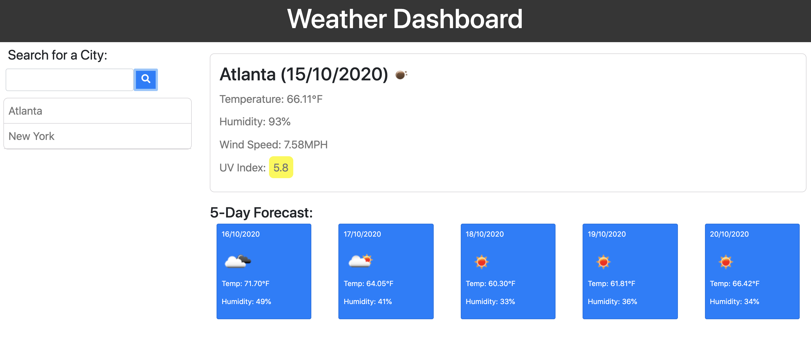

# Weather Dashboard

## What is the purpose of this project? 
The goal of this project is to build a weather dashboard by utilizing a third-party API with specific parameters to a URL. This weather dashboard will run in the browser and feature dynamically updated HTML and CSS. 

 

## How to achieve my goal?
I tried to build the basic web layout in the HTML file with some hardcoded values to help me design the style in the CSS file. Then I incorporated all the appropriate APIs offered by the [OpenWeather](https://openweathermap.org/api) in the Script file under their corresponding functions. Then I created LocalStorage to store all the cities that are searched, so all of the them are displayed on the webpage with the latest search result at the bottom of the page. 
 

## Challenges
With numerous attempts, I realized that the order of the functions and API calls played an important role to make the dashboard work properly. To drill down the correct response in the API was also crucial and yet not simple. I was also not aware that I needed to use latitude and longitude to display the UV index with the API link.
 

## Credits
The initial codes are provided by Trilogy Education Services, a 2U, Inc. brand.

## License
© Irene Asay. All Rights Reserved. Under the [MIT/](./LICENSE.txt) license.
